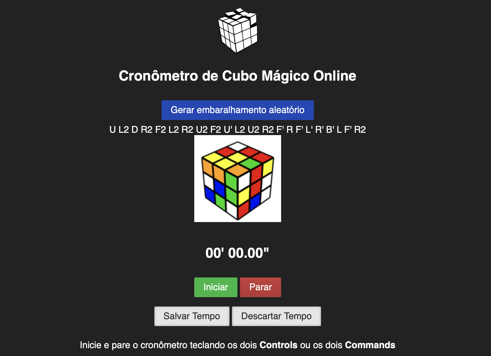

[](https://github.com/emilianoeloi/cronometro-cubomagico/actions/workflows/codeql-analysis.yml)

# Cronômetro de Cubo Mágico Online



Esse projeto tem como objetivo a implementação de um cronômetro para medir a velocidade do cubista leva para montar seu cubo, bem como armazenar para que ele tenha um histórico e manter um ranking dos melhores tempos.

Quer contribuir? Veja o [guia de contribuição](CONTRIBUTING.md).

## Tecnologias

- [React 15](https://legacy.reactjs.org/) (componentes de classe, sem hooks)
- [Vite](https://vitejs.dev/) + [Vitest](https://vitest.dev/) para build, dev server e testes
- [Firebase](https://firebase.google.com/) (Realtime Database + Auth) para persistir e ranquear os tempos

## Desenvolvimento

É preciso ter uma conta no Firebase (https://console.firebase.google.com).

1) Crie um projeto Web.

2) Crie um arquivo `Config.js` dentro da pasta `src` no formato a seguir com sua chave de acesso ao firebase e para o Google Analytics.
```javascript
const config = {
  apiKey: '{sua_chave_aqui}',
  authDomain: '{nome_do_seu_app_web}.firebaseapp.com',
  databaseURL: 'https://{nome_do_seu_app_web}.firebaseio.com',
  storageBucket: '{nome_do_seu_app_web}.appspot.com',
  messagingSenderId: '{message_sender_id}',
  gaUA: '{UA do google analytics}'
};

export { config };
```

3) Execute o setup

```bash
make setup
```

4) Rode o projeto (dev server do Vite)

```bash
make run
```

5) Rode os testes (Vitest)

```bash
make test
```

Depois de uma mudança intencional de render, atualize os snapshots com:

```bash
make test-update
```

6) Faça deploy para seu projeto do firebase (gera o build com Vite e publica)

```bash
make deploy
```

## Estrutura do projeto

- [src/App.jsx](src/App.jsx): componente principal, inicializa o Firebase, controla autenticação e leitura/escrita no Realtime Database.
- [src/Common.js](src/Common.js): funções utilitárias compartilhadas.
- Componentes em `src/<Nome>/index.jsx`: [Stopwatch](src/Stopwatch/index.jsx), [MyTimes](src/MyTimes/index.jsx), [BestTimes](src/BestTimes/index.jsx), [Shuffle](src/Shuffle/index.jsx). [Footer.jsx](src/Footer.jsx) fica na raiz de `src`.
- [public/cubejs](public/cubejs): biblioteca de terceiros (cube.js) usada para gerar os embaralhamentos (scrambles).
- Testes de snapshot em `src/__tests__/*-test.jsx`, rodados com Vitest.

## Outros cronômetros

http://www.cubetimer.com/

https://cstimer.net/

https://www.qqtimer.net/

https://www.cubemania.org/puzzles/3x3x3/timer

http://cinoto.com.br/website/index.php/prisma1

http://cct.cubing.net/

## Referências

cube.js -- JavaScript library for modeling and solving the 3x3x3 Rubik's Cube - https://github.com/ldez/cubejs Acessando em 24/08/2021

